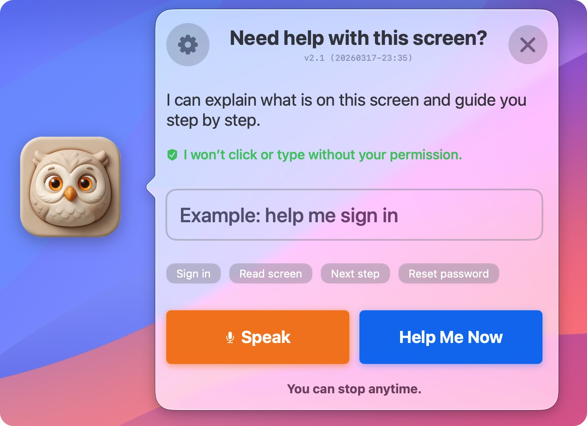
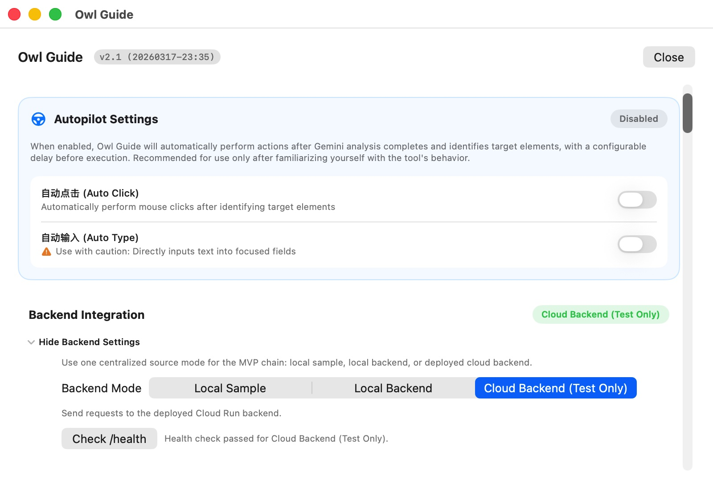
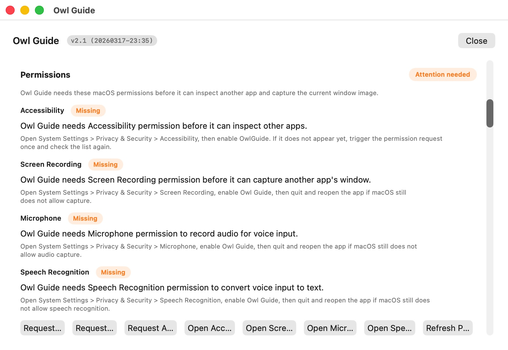
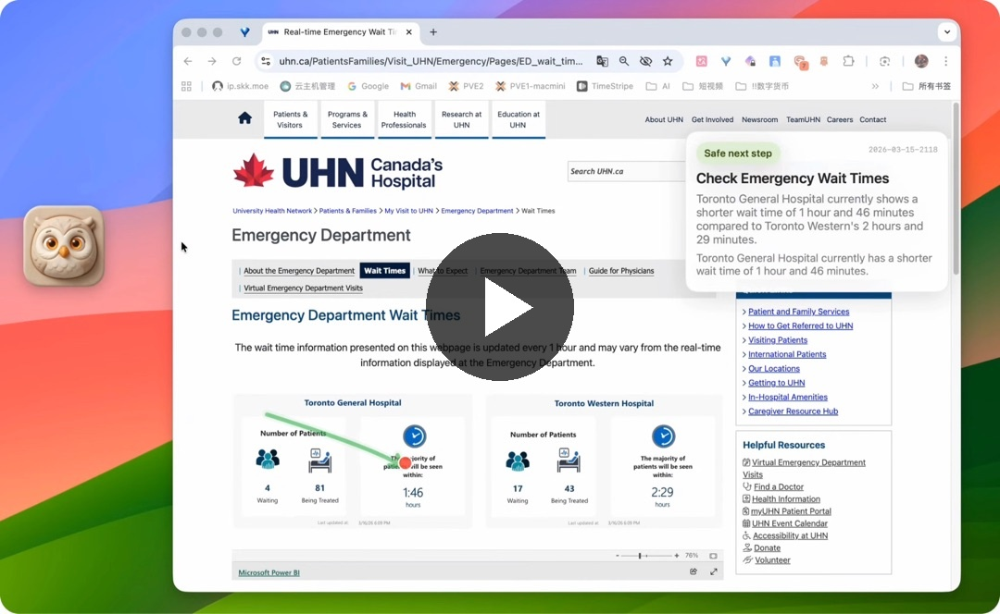

# OwlGuide

**OwlGuide is a macOS desktop companion that helps seniors and digitally vulnerable users understand screens and get step-by-step help.**

OwlGuide was inspired by a simple personal problem: remotely helping my aging parents use a computer. They often knew exactly what they wanted to do, but modern interfaces, unfamiliar terms, and fear of clicking the wrong thing made even simple tasks stressful.

OwlGuide is an attempt to close that gap — not by replacing people, but by making computers feel more understandable, more supportive, and less intimidating.

---

## Why OwlGuide exists

Many older adults can clearly express what they want to do:

- read a message
- find a photo
- sign in to a website
- join a video call
- download a document

But the language of modern computing often stands in the way.

OwlGuide was built to serve as a bridge between human intention and computer interfaces, with a strong focus on:

- clarity
- patience
- permission
- trust
- accessibility

---

## Who it is for

OwlGuide is designed for:

- seniors and older adults
- digitally vulnerable users
- people who are not comfortable navigating modern computer interfaces
- family members who often help parents remotely with computer tasks

---

## What OwlGuide does

- **Explains the current screen** in plain language
- **Provides step-by-step guidance** for what to do next
- **Supports voice-first interaction** for users who prefer speaking over typing
- **Uses permission-based actions** for clicks and typing
- **Prioritizes trust and user control** over aggressive automation

---

## Screenshots


### Main UI


### Setting - Autopilot


### Settings - Permissions


### Demo

[](https://www.youtube.com/watch?v=UySSup-M5iI)

---

## Permissions and safety

OwlGuide is designed around **permission, clarity, and user control**.

Important notes:

- OwlGuide may request **Accessibility permission** to support guided interaction
- OwlGuide does **not** click or type without permission
- users can stop interaction at any time
- the goal is to reduce fear and confusion, not to maximize automation for its own sake

This project should **not** be used for high-risk or sensitive tasks without careful review.

Examples of high-risk tasks include:

- financial transactions
- entering sensitive credentials
- identity verification workflows

---

## Privacy

Privacy matters, especially for a tool that helps interpret on-screen content.

Depending on how OwlGuide is configured:

- some features may run locally
- some features may rely on cloud-based AI services
- user-provided API keys should ideally remain local whenever possible

This repository aims to minimize unnecessary data retention and keep trust boundaries clear.

_Add more exact privacy details here once your architecture is finalized._

---

## Installation

### Requirements

- macOS 14.0+ (Sonoma)
- Xcode with Swift 5.10+
- Accessibility permission enabled
- Microphone permission enabled for voice input
- API key or cloud configuration if using hosted AI features

### Setup

1. Clone this repository
2. Open the project in Xcode
3. Configure required environment variables or local settings
4. Build and run the app
5. Grant the necessary macOS permissions when prompted

```bash
git clone https://github.com/bangbama/owlguide.git
cd owlguide
```

```bash
cd backend
# Deploy to Cloud Run
gcloud run deploy owlguide-backend \
  --source . \
  --platform managed \
  --region us-central1 \
  --allow-unauthenticated \
  --set-env-vars GEMINI_API_KEY="your Gemini API Key" \
  --set-env-vars OWLGUIDE_USE_MOCK_ONLY="false" \
  --memory 1Gi \
  --timeout 30s

```


## Project vision and core features

**One-sentence definition:** OwlGuide is a native macOS desktop assistant that combines screen perception, intent understanding, and permission-based interaction to help users navigate computer interfaces more confidently.

### Core capabilities

* **Visual perception**
  Capture the current window or screen context and analyze it with multimodal AI.

* **Semantic understanding**
  Interpret natural-language requests such as “help me sign in” or “what should I click next?”

* **Grounded interaction**
  Map high-level intent to specific interface elements and on-screen coordinates.

* **Permission-based assistance**
  Support guided clicks, typing, and simple interaction flows with user approval.

---

## Tech stack

* **Core language:** Swift 5.10+
* **UI framework:** SwiftUI (main interactive panel) + AppKit (low-level window management)
* **OS support:** macOS 14.0+ (Sonoma)
* **Key low-level frameworks:**

  * `ApplicationServices (AXUIElement)` for scanning the macOS accessibility tree
  * `CoreGraphics` / `Quartz` for screen capture and simulating mouse/keyboard `CGEvent`
* **AI engine:** Google Gemini multimodal vision model
* **Persistence:** `UserDefaults` (via `@AppStorage` for persistent settings)

---

## Architecture overview

The project follows the **MVVM** architecture.

### Main folder responsibilities

* `App/`
  App entry point, `AppDelegate`, and global state hub (`AppViewModel`)

* `Services/`
  Standalone business logic for scanning, screenshotting, AI communication, and action execution

* `Models/`
  Data structures defining accessibility nodes, AI responses, and scenario guidance

* `Views/`
  SwiftUI implementations for the main control panel and guide overlay layers

* `Windows/`
  Management of macOS window layers, such as the floating ball and translucent overlay window

---

## Core entry points and logical starting points

### First stop for developers: `AppViewModel.swift`

To understand how OwlGuide works, follow this logical flow:

1. **Trigger perception**
   User taps the floating ball to invoke analysis.

2. **Capture snapshot**
   `WindowScreenshotService` captures the current window image.

3. **Semantic analysis**
   The image is sent to `GeminiScreenUnderstandingService` for interpretation.

4. **Coordinate grounding**
   Analysis results are combined with outputs from `AccessibilityScanner` to compute target pixel coordinates.

5. **Action execution**
   `ActionExecutionService` performs the approved click or keyboard interaction.

### Key functions

* `AppViewModel.executeAnalysisChain()`
  Main engine for a single analysis task

* `ActionExecutionService.click(at:)`
  Async interaction entry point for click simulation

* `triggerAutopilotIfEnabled()`
  Entry point for optional assisted auto-trigger logic

---

## Current status

OwlGuide is currently an early-stage prototype.

Current priorities include:

* improving the senior-friendly interface
* strengthening trust and permission flows
* refining voice and screen guidance
* reducing setup complexity
* making the experience safer and more accessible

---

## Roadmap

Planned directions include:

* richer step-by-step workflows
* improved screen understanding
* better voice guidance
* simpler onboarding
* local-first or bring-your-own-key options
* stronger privacy and safety controls
* broader accessibility support

---

## FAQ

### Does OwlGuide click automatically?

No. OwlGuide is designed around permission and user control. It does not click or type without permission. 

### Is OwlGuide only for seniors?

No. OwlGuide is especially designed for seniors and digitally vulnerable users, but it may also help anyone who feels uncomfortable with modern computer interfaces.

### Does OwlGuide send screenshots to the cloud?

That depends on how OwlGuide is configured. Some features may run locally, while others may rely on cloud-based AI services. The goal is to keep these trust boundaries as clear as possible.

### Can users bring their own API key?

YES. A local-first or bring-your-own-key setup is one of the ways OwlGuide can improve privacy and long-term sustainability.

### Is OwlGuide suitable for financial or other high-risk tasks?

Not by default. High-risk tasks should be handled carefully and reviewed by the user. OwlGuide is intended to reduce confusion, not to replace human judgment in sensitive workflows.

---

## Contributing

Contributions are welcome.

Helpful areas include:

* macOS development
* accessibility UX
* privacy and safety design
* multimodal interaction
* onboarding for non-technical users
* documentation improvements

If you want to contribute, please open an issue or start a discussion first.

---

## Why this project is open source

OwlGuide is open source because the problem it addresses is larger than one product. Many older adults and digitally vulnerable users are still left behind by software that assumes speed, confidence, and technical familiarity.

I hope this project can become both a useful tool and a starting point for broader work in humane, accessible computing.

---

## License

MIT License

```
# Copyright (c) 2026 Yixuan Xu 
# This software is released under the MIT License. 
```